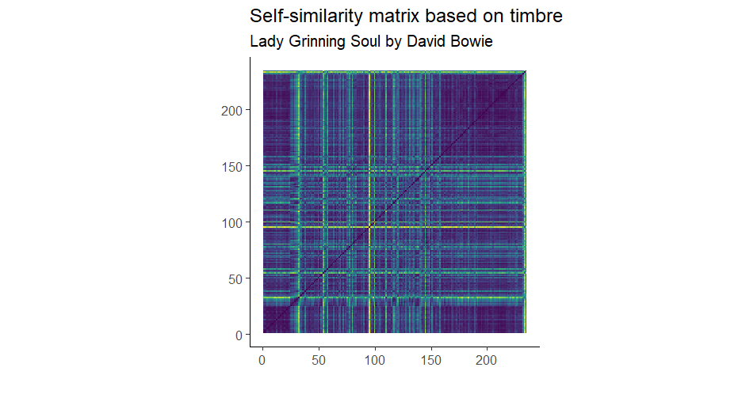
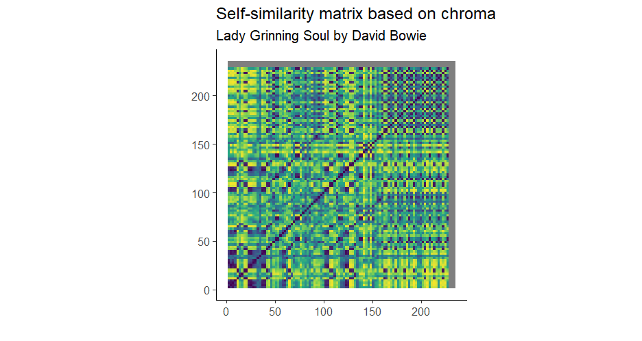

## Computational Musicology

### Homework week 9

Meike Cavelaars

I made self-similarity matrices based on chroma and timbre for the song *Lady Grinning Soul* by David Bowie. The chroma matrix shows a low degree of self-similarity throughout the whole song. As the matrix is quite yellow overall, not a lot of information can be retrieved from it. In the timbre matrix, de structure of the song is clearly reflected. The song starts with just piano, and after about 30 seconds, the singing and drums start, corresponding to the first vertical yellow line. After ±50 seconds, there is a short silence, reflected in the second vertical yellow line. At about 95 seconds, a very clear yellow line is visible. This probably corresponds to the instrumental solo that starts at this point, although I am not entirely sure about that. After around 150 seconds, the matrix remains quite dark, indicating a high degree of self-similarity. I am not sure why, as from this part on, the song is mostly instrumental, with more prominent guitar and piano solos. Since this deviates from the rest of the song, I would have expected a decrease in similarity rather than an increase.
