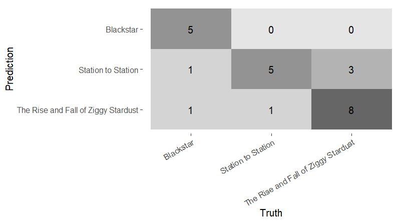
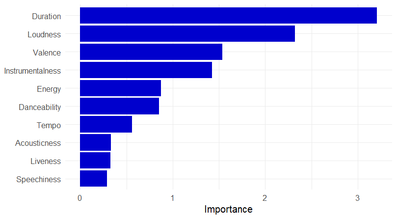
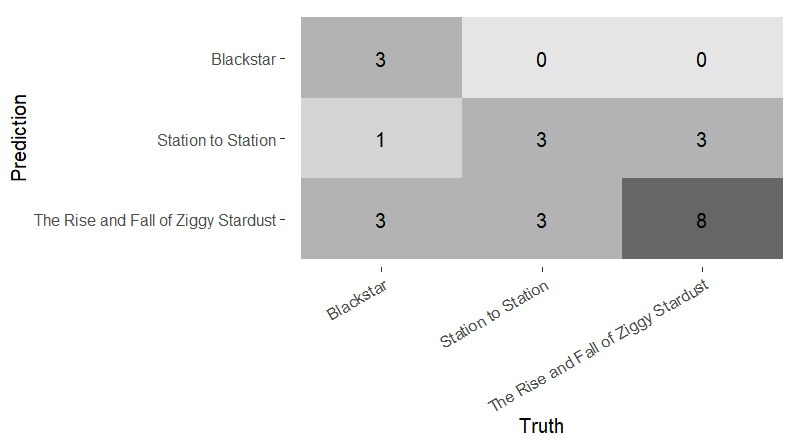
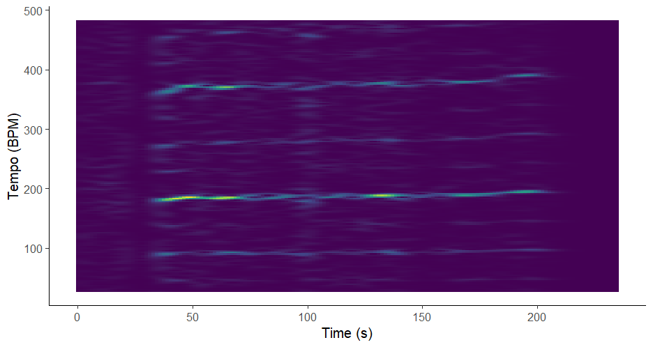

# Week 12
 
## 
**Confusion matrix for 3 different David Bowie albums:**

  

## 
**Feature importance:**  

The model can classify the songs quite well. However, the feature importance graph shows that the duration of the songs was the most important feature. As I am more interested in the *sound* of the music, and not the length of the song, I modeled it again, this time without the Duration feature. 

## 
**Confusion matrix without Duration:**

  

Although the classification is performing slightly less well now, the model is still reasonably good at classifying the songs. 

# David Bowie albums

## Week 11

Week 11: Tempogram of *Lady Grinning Soul* by David Bowie

The tempogram shows lines around 100 BPM, slightly under 200 BPM and under 400 BPM. This corresponds to the tempo of the song, which is around 94 BPM (so 188 BPM if you use double-time). \
The tempo slightly fluctuates throughout the song, mainly because of the expressive piano playing. This is also reflected in the tempogram, as the lines are not exactly straight. \
In the first 30 seconds, a clear line in the tempogram is missing. This is because the song starts with a piano intro that does not have a steady rhythm. As soon as the percussion and other instruments come in, the lines in the tempogram start to show up. 

## Week 9

Week 9: Self Similarity Matrices\
 \
Self similarity matrix of *Lady Grinning Soul* by David Bowie, based on timbre

 

## Week 10

Week 10: Keygram and chordogram

