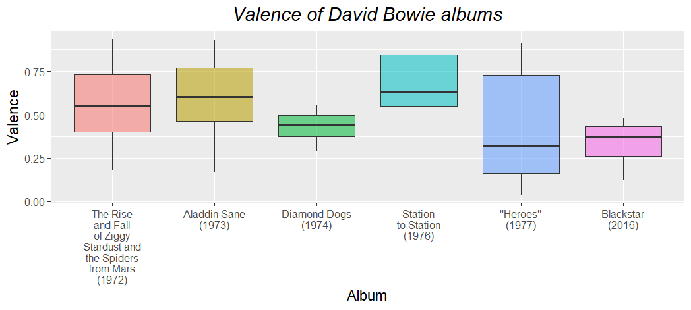
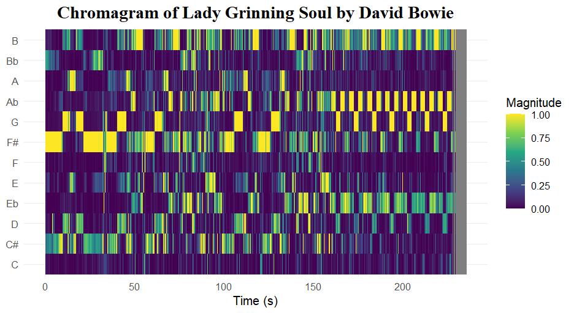
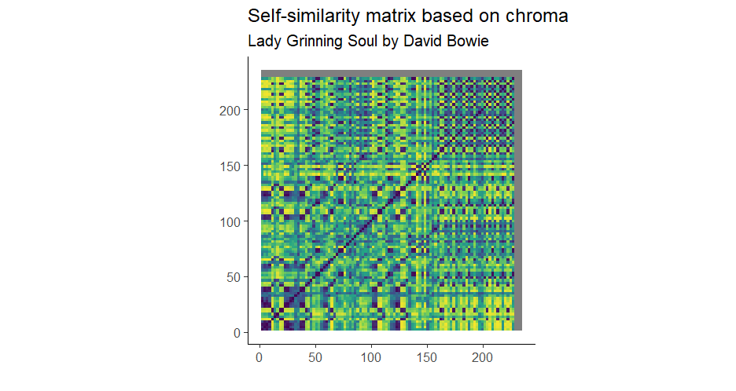
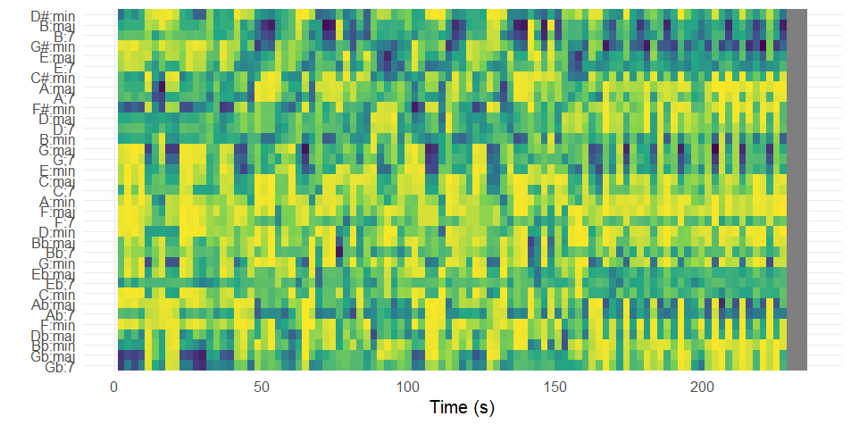
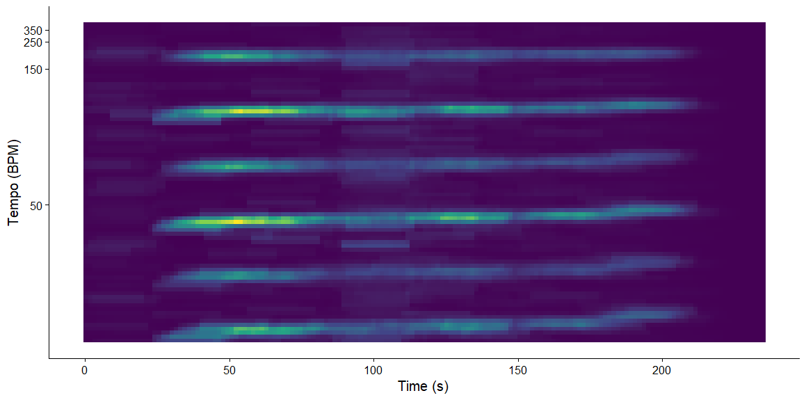
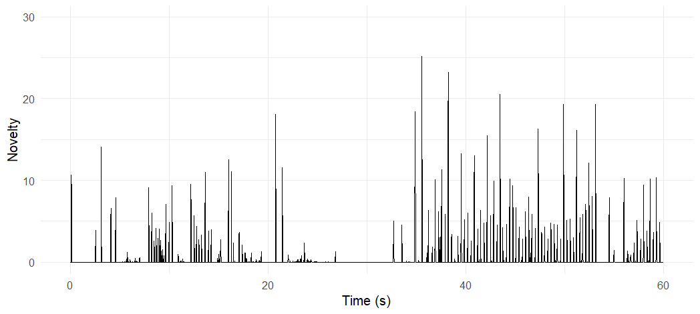
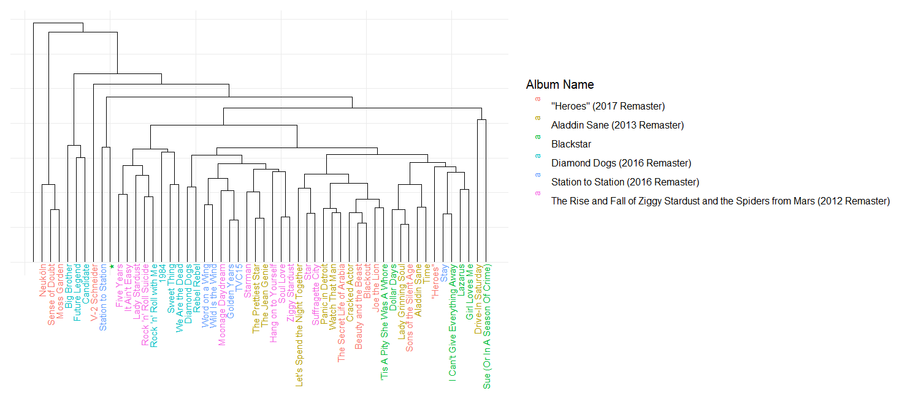
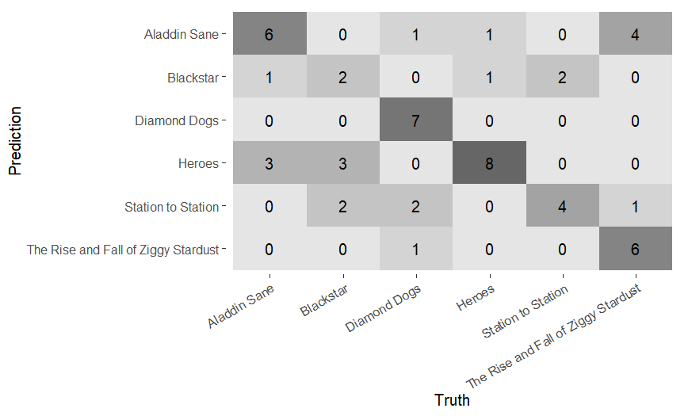
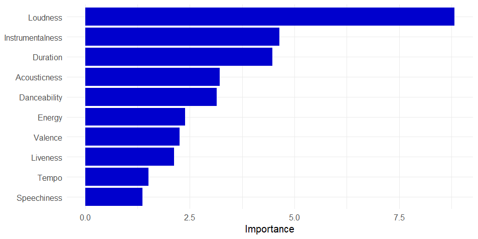

# Background

## Introduction

To me, David Bowie has always been an incredibly interesting musician, as his oeuvre has encompassed many different genres over the years. Moreover, these different genres and albums were often accompanied by personas that Bowie created, each with their own distinct look and personality.

Since my own (academic) background is not in musicology or AI, but in cognitive neuroscience, I want to incorporate my interest in the human mind and emotions into this portfolio as well. Therefore, I am interested in the question of whether Bowie's various personas and eras are reflected in the music information, for example, whether the albums have specific characteristics in the track-level Spotify functions.

Therefore, my chosen corpus of music are six David Bowie albums that are linked to a distinct Bowie persona or era. The albums are: The Rise and fall of Ziggy Stardust and the Spiders from Mars, Aladdin Sane, Diamond Dogs, Station to Station, Heroes, and Blackstar.

## foto

\
*Source: de Volkskrant (2012)*

# Track-level features (wk7)

## Valence per album

## Text

Valence describes the positiveness of a song; songs with high valence sound happy or cheerful, while low valence songs sound sad or angry. Spotify assigns a value from 0.0 to 1.0, where 1 is positive and 0 is negative.

When comparing the six albums of this corpus, the most striking difference is not so much the median valence, but rather the differences in the width of the interquartile range of each album. For instance, the valences of the songs on *Diamond Dogs* seem to lie quite close to each other, whereas those of *“Heroes”* are much further apart.

Another interesting point is that the the songs on *Blackstar* have a lower valence, with every song on the album scoring below 0.5. This is not entirely unexpected, as this is the album Bowie released shortly before his death as a farewell gift for his fans. Death is a recurring theme in the lyrics of the entire album, and this is apparently reflected in the musical valence as well.

On *Station to Station*, on the other hand, every track on the album scores above 0.5. This higher valence is also not surprising, given that this album is known for its funk and disco influences, genres that generally have a more ‘positive’ sound.

In summary, although the albums do not greatly differ in median valence, there are some differences in range and other observations that can be linked to the albums’ themes and genres.

# Chroma (wk8)

## Chromagram

## Text

I made a chromagram (using the Chebyshev norm) of *Lady Grinning Soul* by David Bowie. I have chosen to study this particular track more closely because it has always been one of my favourites and I consider it one of his most interesting tracks. Not only in terms of instrumentation, but also in terms of structure and harmony, it sounds different from a 'conventional' rock or pop song. By zooming in on chroma, I hope to better understand what makes this track stand out.   

The song starts in F# minor, which can be clearly seen in the chromagram, with the F# pitch showing a high magnitude, as well as the C#. However, in the song outro, the G#m chord is mainly present. This is also reflected in the chromagram, with the A flat pitch (or G sharp) clearly standing out. Additionally, this G#m chord alternates with a G chord, which is also seen in the alternating of the A flat and G pitches in the chromagram. This alternation creates a ‘dramatic’ feel, adding to the symphonic character of the song. These chroma features show that *Lady Grinning Soul* does not only use the pitches one would expect in an F# minor key, which partly explains why this does not feel like a ‘standard’ rock song.

# Self-similarity (wk9)

## Row {.tabset}

### Chroma

### Timbre

## Text

I made self-similarity matrices based on chroma and timbre for the song *Lady Grinning Soul*. Both matrices use Euclidean norm and cosine distance. The chroma matrix shows a low degree of self-similarity throughout the song. As the matrix is quite yellow overall, not a lot of information can be retrieved from it. However, there are some clear diagonals, showing similarity between the 50-100 seconds and the 100-150 seconds part. These parts approximately correspond to the first and second repetition of the verse and chorus, so it is logical they show similarity in chroma. In the outro of the song, a checkerboard pattern is visible. This is probably caused by the alternation of the G#m and G chord, as we saw in the chromagram on the previous page.   

In the timbre matrix, the structure of the song is clearly reflected. The song starts with just piano, and after about 30 seconds, the singing and drums start, corresponding to the first vertical yellow line. After ±50 seconds, there is a short silence, reflected in the second vertical yellow line. At about 95 seconds, a very clear yellow line is visible. This probably corresponds to the instrumental solo that starts at this point. After around 150 seconds, the matrix remains dark, indicating a high degree of self-similarity. From this moment on, the instrumentation remains quite rich and constant, with piano and electric guitar continuously soloing over each other. This part can be seen as a long outro, as it steps away from the verse-chorus alternation and is purely instrumental, after which it fades out.   

An interesting point is that there seem to be similarities between the intro and outro. This is striking as the intro solely consists of piano, while the outro has a much richer instrumentation. However, the piano does still have a prominent role in the outro, and both parts are entirely instrumental, which might be the cause for the similarity in timbre.

# Chordogram (wk10)

## Chordogram 

**Chordogram of *Lady Grinning Soul***
  

## Text

This chordogram was made using the Manhattan norm and Manhattan distance. At first glance, the activity looks diffuse and unstructured. This already hints at the fact that this track does not use a simple pop progression, but a more rich and varied harmony. There is a constantly rapid change of chords, reflected in the narrow vertical lines. The diffuse activity may be because of the fact that the track uses extended chords, causing many chords to share notes and thus all show activity.   

This chordogram also gives some information about the different sections of the track. The middle part (±60-150s) shows less structure than the beginning, pointing to an increase of harmonic complexity. The end (after ±150s) shows more vertical stripes, pointing to more rapid chord changes, which corresponds to what we saw in the chromagram and self-similarity matrix. 

# Tempo and novelty (wk11)

## Row {.tabset}

### Fourier

**Tempogram for *Lady Grinning Soul***

The Fourier-based tempogram shows lines around 100 BPM, slightly under 200 BPM and under 400 BPM. This corresponds to the tempo of the song, which is around 94 BPM (so 188 BPM if you use double-time). The tempo slightly fluctuates throughout the song, mainly because of the expressive piano playing. This is also reflected in the tempogram, as the lines are not exactly straight. In the first 30 seconds, a clear line in the tempogram is missing. This is because the song starts with a piano intro that does not have a steady rhythm. As soon as the percussion and other instruments come in, the lines in the tempogram start to show up.

### Autocorrelation

**Tempogram for *Lady Grinning Soul***

In the autocorrelation-based tempogram, the line around 94 BPM is also clearly visible and again shows a slight fluctuation in tempo. In this graph, however, the subharmonics are more clearly visible, showing up as subdivisions of 94. These tempograms visualize the slight fluctuation in tempo throughout the track, and the absence of a steady rhythm in the intro, both contributing to the expressiveness of the song.

## Novelty

**Novelty function for the first minute of *Lady Grinning Soul***

This energy-based novelty function of the first 60 seconds of the track allows us to look at the interesting structure of the beginning of the track, based on loudness.

The song immediately starts with a dramatic piano chord, followed by a short silence. This is reflected in the immediate peak that is visible in the novelty function. The first 25 seconds consist of a piano intro, followed by a slightly longer silence, which is also clearly visible in the novelty function. Then, at 32 seconds, Bowie starts singing, and at 35 seconds, the piano, bass and drums all kick in at the same time, resulting in the highest peak in this novelty function. The verse has started, and the novelty function shows a more rhythmic pattern. The interruption in the novelty function around 53 seconds is again caused by a silence, after which the verse continues. This loudness-based visualization proves to be suitable for representing the precise structure of the rather unconventional intro of this track.

# Classification (wk12)

## Dendrogram

**Dendogram of all six David Bowie albums** 🔍

The plot shows the hierarchical clustering of all the songs in the corpus, and was made by using the linkage method *average* and with Euclidean distance.  
Tracks from the same album seem to be clustered closely together quite often, although several tracks appear far removed from the rest of the album. 

## Row {.tabset}

### With duration

**Confusion matrix for the classification of 3 David Bowie albums** 

To further investigate the (dis)similarities between tracks from the same and from other albums, I used a k-nearest neighbor classifier to classify the songs of 3 Bowie albums.   
The model can classify the songs quite well, having an accuracy of 75%. However, the feature importance graph (visible on the right) shows that the duration of the songs was the most important feature. As I am more interested in the *sound* of the music, and not the length of the song, I modeled it again, this time without the Duration feature.

### Without duration

**Confusion matrix without Duration** 

The tracks were classified again, this time leaving out the duration feature. Although the accuracy has dropped to 58%, the model still performs much better than chance. This implies that even when we ignore the different track lengths, the albums do indeed each have their own 'sound'.

## Feature importance

**Feature importance**

This feature importance graph shows that, besides duration, loudness, valence and instrumentalness were the most important features for classifying the songs. 

Taking a closer look at the song lengths of the different albums, it is not surprising the model initially took duration as the most important feature. The tracks on *Station to Station* are relatively long, lasting 6:24 minutes on average. *Blackstar* has an average song length of 5:54. *The Rise and Fall of Ziggy Stardust* has significantly shorter tracks, with an average duration of 3:31.

# Conclusion 

**Conclusion**    

This portfolio focused on six albums by David Bowie, each linked to a distinct Bowie persona or era.   
The track-level feature **valence** showed that although the albums do not greatly differ in median valence, there are some differences in range and other observations that can be linked to the albums’ themes and genres.

Zooming in on the track *Lady Grinning Soul*, to find out what makes it different from a 'regular' rock song, several observations were made.   
The **chromagram** showed that although the song is mostly in the key of F# minor, it also uses pitches outside of this key. The **chordogram** supported this and showed a rich harmony, with extended and rapid changing chords.    
The **self-similarity matrices** revealed a low degree of self-similarity in chroma. When looking at self-similarity in timbre, the song's structure became visible.   
To look more closely at the intro's structure, the loudness-based **novelty-function** proved to be useful.   
The **tempogram** visualised the slight fluctuation in tempo throughout the track, and the absence of a steady rhythm in the intro, both contributing to the expressiveness of the song. 

Zooming out to all tracks, the knn-model could classify the songs of 3 different Bowie albums reasonably well. However, after removing duration (the most important feature) from the model, the accuracy decreased. Nonetheless, the classification is still much better than chance, indicating the 3 albums really do have their own sound.   

To really be able to conclude whether the albums differ musically from each other, all six must be examined. For that reason, I had a knn-model classify all six albums. The confusion matrix can be seen below.   

{width=50%}  

With all six albums, the model can still classify the songs relatively well, with an accuracy of 60%. This score is far from perfect, but nonetheless much better than chance. To ensure that this classification was not also mostly based on duration, I plotted the feature importance.  

{width=50%}  

This time, loudness was the most important feature to classify the tracks, followed by instrumentalness. Duration comes in after these two features.   

With an accuracy much higher than chance when classifying songs all made by David Bowie but from different albums, it seems that each album does have its own musical style. This portfolio is not sufficiently extensive to confirm what specific characteristics each album has, but it does provide an indication that these albums have their own characteristics. This would mean that Bowie's different personas are not only about the looks, but are actually reflected in the music he made.   

The results of this analysis may be of interest to researchers in fields such as musicology and computational music analysis, as they illustrate a simple approach to quantitatively comparing musical characteristics across albums. While this study is limited, it provides a small example of how computational methods can be applied to explore stylistic variation. In addition, listeners and fans of David Bowie may find the results useful as a complementary perspective on perceived differences between albums. However, given the relatively simple methodology and dataset, the findings should be interpreted with caution and not seen as definitive.  

Working on this portfolio taught me to make the link between listening to and 'feeling' the music on one hand, and approaching it analytically on the other. I have always wondered what makes songs sound 'original', and never realised that it is possible to study this through a computational lens, instead of only by listening. Using computational models makes it possible to actually prove that two albums are different, in an objective way.   
